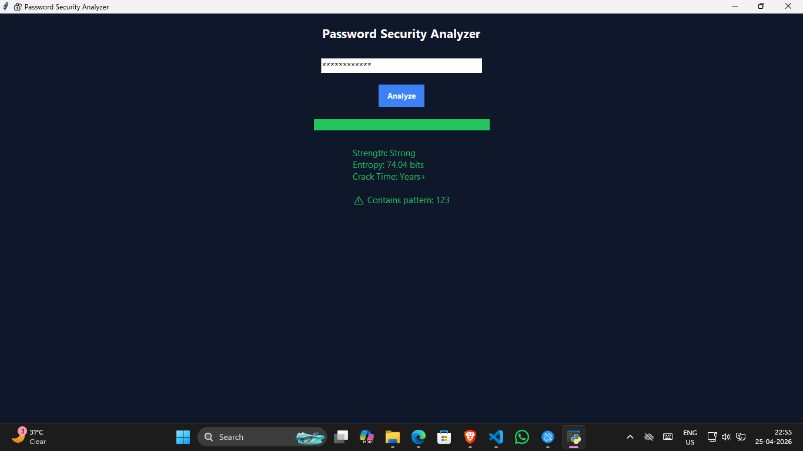

# 🔐 Password Security Analyzer

A Python-based advanced password analysis tool that evaluates password strength using entropy calculation, pattern detection, and estimated crack time.

---

## 🚀 Features

- 🔢 **Entropy Calculation**
  - Measures real password strength using mathematical entropy

- 🧠 **Pattern Detection**
  - Detects weak/common patterns like `123`, `admin`, `password`, etc.

- ⏱️ **Crack Time Estimation**
  - Estimates how long a password would take to brute-force

- 📊 **Strength Visualization**
  - Dynamic strength bar (Weak / Medium / Strong)

- 🎨 **Modern GUI**
  - Built using Tkinter with dark theme UI

---

## 🧠 How It Works

The analyzer evaluates passwords based on:

- Character set diversity (uppercase, lowercase, digits, symbols)
- Password length
- Known weak patterns
- Entropy formula:


Entropy = Length × log₂(Character Set Size)


Higher entropy → stronger password → harder to crack

---

## 🖥️ Demo

### 🔍 Password Analysis


---

## ⚙️ How to Run

```bash
python password_checker.py
📁 Project Structure
password-checker/
├── password_checker.py
├── README.md
└── screenshots/
    └── ui.png
🎯 Use Cases
Learn password security concepts
Demonstrate cybersecurity fundamentals
Educational tool for beginners
⚠️ Limitations
Crack time estimation is approximate
Does not check real-world data breaches (offline tool)
👨‍💻 Author

Ketan Jadhav
Aspiring SOC Analyst

📌 Internship Task

This project was built as part of the CodeAlpha Cyber Security Internship.


---

# 💣 Brutal truth

This README:
- explains logic ✔️  
- shows understanding ✔️  
- looks professional ✔️  

👉 This is what separates you from “just another intern”

---

# 🚀 FINAL STEP

```powershell
git add .
git commit -m "Added password analyzer with README"
git push